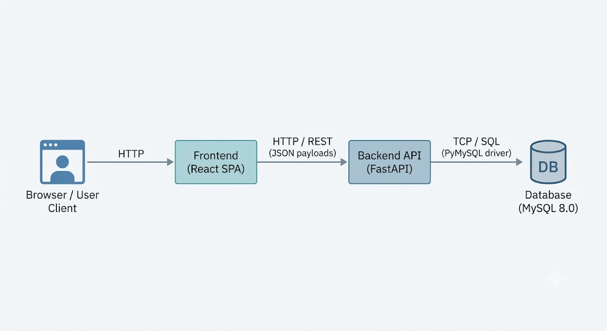

# Arquitetura do Sistema — RepOP

> **RepOP** é um buscador de repúblicas estudantis em Ouro Preto.  
> Este documento descreve como o sistema foi estruturado por dentro: seus componentes, como eles conversam entre si e quais ferramentas foram escolhidas — e por quê.

---

## 1. Visão Geral

A arquitetura segue o modelo clássico **Client-Server em três camadas** (multi-tier), com cada responsabilidade bem isolada em seu próprio espaço. Tudo roda em containers Docker, o que torna o ambiente previsível tanto no desenvolvimento quanto em produção.

---

## 2. Os Três Pilares do Sistema

### 🖥️ Frontend — O que o usuário vê

É uma **Single Page Application (SPA)** construída em React. Toda a experiência visual acontece aqui: navegar pelo catálogo de repúblicas, fazer buscas, se cadastrar e gerenciar vagas.

- Vive no diretório `frontend/`
- Se comunica com o backend via chamadas HTTP assíncronas
- Usa a variável de ambiente `VITE_API_URL` para saber onde o backend está (ex: `localhost:8000` em desenvolvimento)

---

### ⚙️ Backend — O cérebro da operação

Uma **API RESTful** feita com FastAPI. É aqui que as regras de negócio vivem: autenticação, validações, filtros de busca, lógica de vagas. O frontend pede, o backend processa e devolve os dados estruturados em JSON.

- Vive em `backend/`, com foco em `app/` e `main.py`
- Roda sobre o servidor ASGI **Uvicorn**
- Conecta ao banco via driver **PyMySQL** na porta `3306`

---

### Database — A memória do sistema

Um banco **MySQL 8.0** rodando em container isolado. Guarda tudo que precisa persistir: usuários, repúblicas, vagas e regras.

- Acesso exclusivo pelo backend (o frontend nunca fala direto com o banco)
- Conexão gerenciada por pool via `DATABASE_URL`

---
## 3. Como os Componentes se Comunicam

**Passo a passo:**

1. **Browser → Frontend:** O browser carrega os assets estáticos (HTML, JS, CSS) servidos pelo Vite.
2. **Frontend → Backend:** Chamadas assíncronas para endpoints como `GET /republicas` ou `POST /users`, resolvendo o host via `VITE_API_URL`.
3. **Backend → Database:** O servidor mantém um connection pool com o MySQL via PyMySQL, conectando pelo hostname do container na porta `3306`.

---

## 4.Tech Stack

As ferramentas foram escolhidas priorizando **alta performance em I/O** (FastAPI assíncrono) e **deploy simplificado** (Docker Compose).

### Frontend
| Ferramenta | Papel |
|---|---|
| **React** | Biblioteca core para UI baseada em componentes |
| **Vite** | Build tool e dev server — muito mais rápido que o CRA |
| **JavaScript / HTML / CSS** | A base da web |

### Backend
| Ferramenta | Papel |
|---|---|
| **Python 3** | Linguagem principal |
| **FastAPI** | Framework web assíncrono de alta performance |
| **Uvicorn** | Servidor ASGI que roda a aplicação FastAPI |
| **PyMySQL** | Driver de conexão direta com o MySQL |

### Banco de Dados
| Ferramenta | Papel |
|---|---|
| **MySQL 8.0** | RDBMS para persistência relacional de todas as entidades |

### Infraestrutura / DevOps
| Ferramenta | Papel |
|---|---|
| **Docker** | Containerização — isola e empacota cada serviço |
| **Docker Compose** | Orquestra `frontend`, `backend` e `db` numa rede compartilhada, permitindo service discovery simples por nome de host |

---

*Última revisão: junho de 2026*
